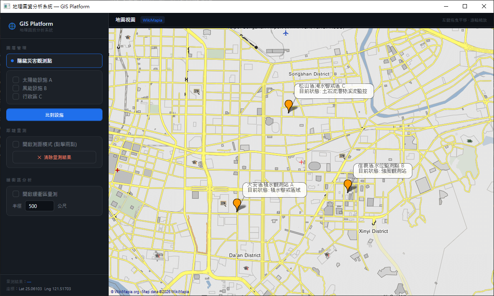
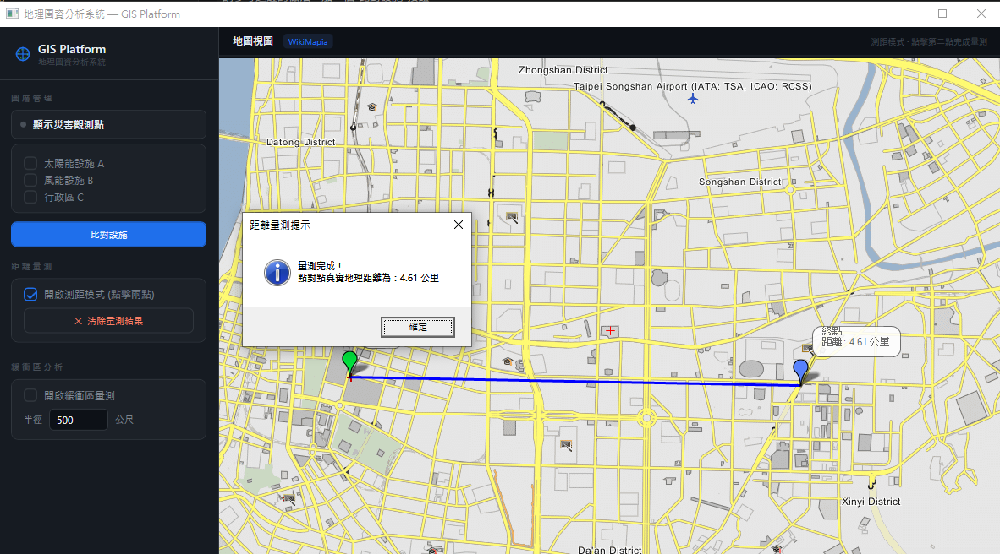
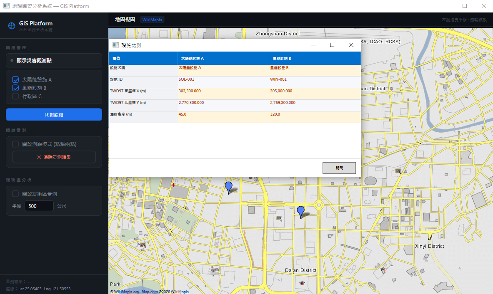
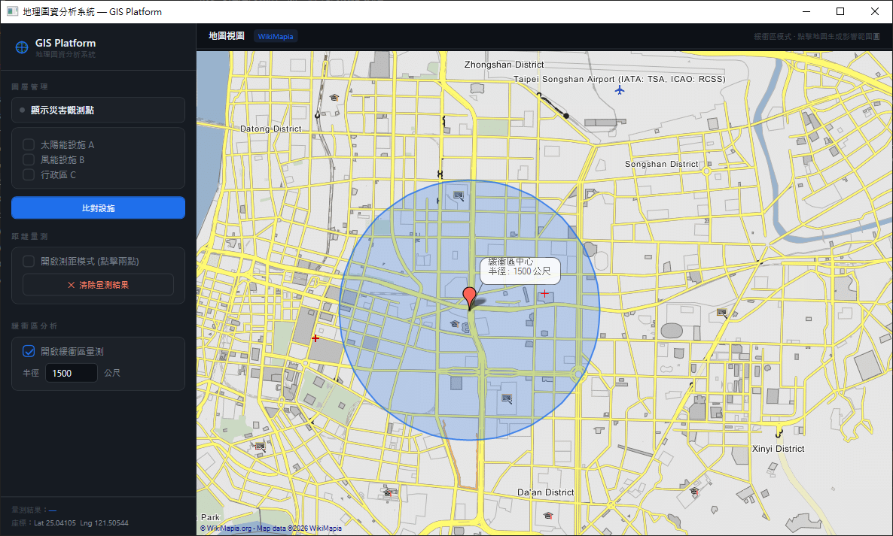

# GisPocWPF

A GIS (Geographic Information System) proof-of-concept desktop application built with WPF and C#.
This project demonstrates map rendering, spatial analysis, layer visualization, and GIS-related desktop workflow integration using .NET technologies.

---

# Features

* Interactive GIS map viewer
* Facility comparison visualization
* Buffer analysis
* Distance / measurement tools
* Disaster warning pin visualization
* Coordinate display and map interaction
* Zoom and pan support
* WPF desktop UI implementation
* Modular GIS experimentation architecture

---

# Tech Stack

* C#
* .NET
* WPF (Windows Presentation Foundation)
* XAML
* GIS / Spatial Visualization

---

# Screenshots

## Disaster Warning Pins



Visualization of disaster warning locations and map-based spatial alerts.

---

## Measurement Tool



Interactive GIS distance measurement functionality.

---

## Facility Compare



Spatial comparison and visualization between multiple facilities.

---

## Buffer Analysis



Buffer area generation and spatial range analysis.

---

# Project Structure

```text
GisPocWPF/
├── docs/
│   └── images/
├── Models/
├── Services/
├── ViewModels/
├── Views/
└── App.xaml
```

---

# Getting Started

## Requirements

* Visual Studio 2022 or later
* .NET SDK
* Windows OS

## Build & Run

```bash
git clone https://github.com/CharlesWilliamW/GisPocWPF.git
```

Open the solution in Visual Studio and run the project.

---

# Purpose

This repository was created as a GIS desktop application proof-of-concept for experimenting with:

* GIS visualization workflows
* Desktop spatial interaction
* WPF-based map UI architecture
* Spatial analysis visualization
* Modular GIS application design

---

# Future Improvements

* Real-time government API integration
* Layer grouping & filtering
* Offline tile caching

---

# License

MIT License
